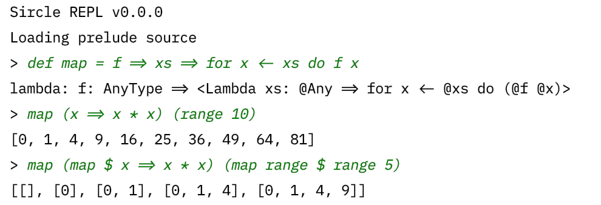

# CoordML

Manage ML experiments with ease.

CoordML is a light-weight Machine Learning experiment tool that enables users to easily define computational tasks and distribute tasks across multiple instances. It can also aggregate and display experiment results through a unifed web interface.

CoordML is currently working in progress. It consists of the following major components:

- *Sircle DSL*, a functional and interpreted language, used to define computational tasks in a expressive and flexible way. **(Finished)**
- *CoordML Central*, the central server to create experiments and distribute tasks. **(Finished)**
- *Runner*, to run tasks and extract results. **(Finished)**
- *Web Portal*, to display runner status and experiment results and aggregate experiment results in a flexible and clear way. **(Finish)**

## Sircle DSL

Sircle is a powerful DSL for defining computational tasks. It is in functional styles, supporting first-class functions, ML-style application and currying.

A simple example of Sircle:

    map (compose println $ x => "Hello, " + x) ["Sircle", "CoordML"]

This will print out

    Hello, Sircle
    Hello, CoordML

For a detailed guide to Sircle, you may refer to the [Documentation](https://coordml.github.io/sircle_dsl/introduction/).
